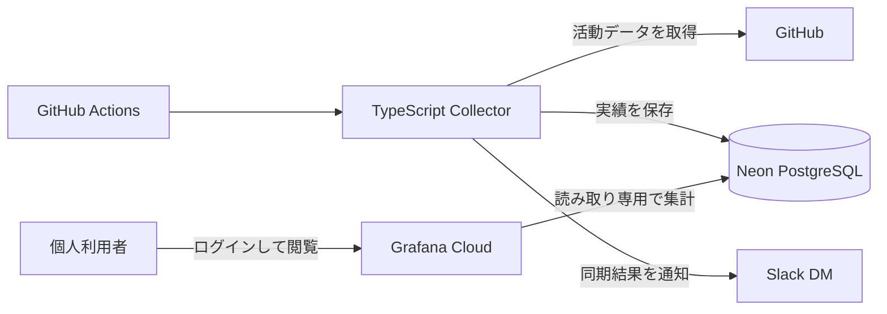

# Output Pulse

Output Pulseは、GitHub上の個人開発の活動実績を定期収集し、Grafana Cloudで振り返るための個人用ダッシュボードです。

コミット、Pull Request、完了IssueをNeon PostgreSQLへ保存し、期間ごとの実績や推移を確認できます。常駐サーバーを持たず、GitHub Actionsで収集処理を実行します。

## できること

- コミット、作成PR、マージPR、完了Issueを期間ごとに集計する
- 日別・週別の活動推移と、完了Issueのタイトル・日時を確認する
- GitHub Actionsによる定期同期と、Slack DMによる実行結果の通知を受け取る
- Privateリポジトリを含めて集計しつつ、Grafanaにはリポジトリ名やGitHub URLを表示しない

閲覧はGrafana Cloudへログインした個人利用者に限定します。外部共有リンクは発行しません。

## システム構成

## 詳細ドキュメント

### アプリケーション設計

- [要件定義](docs/requirements.md)
- [アーキテクチャ](docs/architecture.md)
- [データベース設計](docs/database-design.md)
- [同期仕様](docs/synchronization.md)
- [セキュリティ設計](docs/security.md)

### セットアップ・運用

- [ローカル開発手順](docs/local-development.md)
- [運用設計](docs/operations.md)
- [DBマイグレーション手順](docs/database-migrations.md)
- [本番Neon・Grafana Cloudセットアップ手順](docs/production-neon-grafana-setup.md)

### リポジトリ運用

- [開発ガイド](docs/development-guide.md)
- [AIエージェント向けルール](AGENTS.md)
- [本番移行の確認結果と既知制約（Release Issue #18）](https://github.com/mytysoldier/output-pulse/issues/18)
