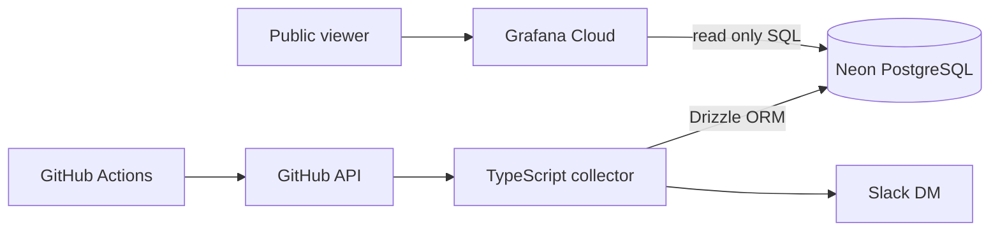

# アーキテクチャ

## 全体構成

## 採用技術

| 領域 | 採用技術 | 理由 |
| --- | --- | --- |
| 言語 | TypeScript / Node.js | 型安全かつGitHub Actionsで実行しやすい |
| パッケージ管理 | pnpm | 高速で依存関係を厳密に管理できる |
| GitHub API | Octokit | GitHub公式クライアントを利用できる |
| DB操作 | Drizzle ORM | SQLに近い型安全な操作とUpsertが可能 |
| Migration | Drizzle Kit | SchemaとSQL MigrationをGit管理できる |
| DB | Neon PostgreSQL | 小規模・断続的負荷と無料枠の相性が良い |
| Scheduler | GitHub Actions | 常駐サーバーが不要 |
| 可視化 | Grafana Cloud | PostgreSQLを直接集計し外部共有できる |
| 通知 | Slack Web API | 個人WorkspaceのDMへ通知できる |
| Test | Vitest | TypeScriptとの統合が容易 |
| ローカルDB | Docker Compose | PostgreSQL環境を再現しやすい |

## コンポーネントの責務

### 収集スクリプト

- GitHub APIからリポジトリ、actor、コミット、PR、Issueを取得する
- 対象判定、JST変換、正規化、Upsertを行う
- リポジトリ単位でエラーを隔離して後続処理を継続する
- 同期履歴を記録し、最後にSlackへ通知する

### Drizzle

- 内部テーブルの型定義とDB操作を担う
- Drizzle KitでMigration SQLを生成・適用する
- Grafana用ViewとDB権限は明示的なSQL Migrationで管理する

### Grafana Cloud

- GitHub APIやDrizzleを実行しない
- Neon PostgreSQLへ読み取り専用ユーザーで直接接続する
- 公開用Viewを期間指定SQLで集計し、ダッシュボードへ表示する
- 完成したDashboard JSONを`grafana/dashboards/`へExportしてGit管理する

## デプロイ方針

- 常駐アプリケーションはデプロイしない
- GitHub Actions runner上で同期時のみNode.jsスクリプトを実行する
- Neon、Grafana Cloud、Slack Appの初期作成・接続設定は手動で行う
- Terraformによる自動構築はMVP対象外とする
