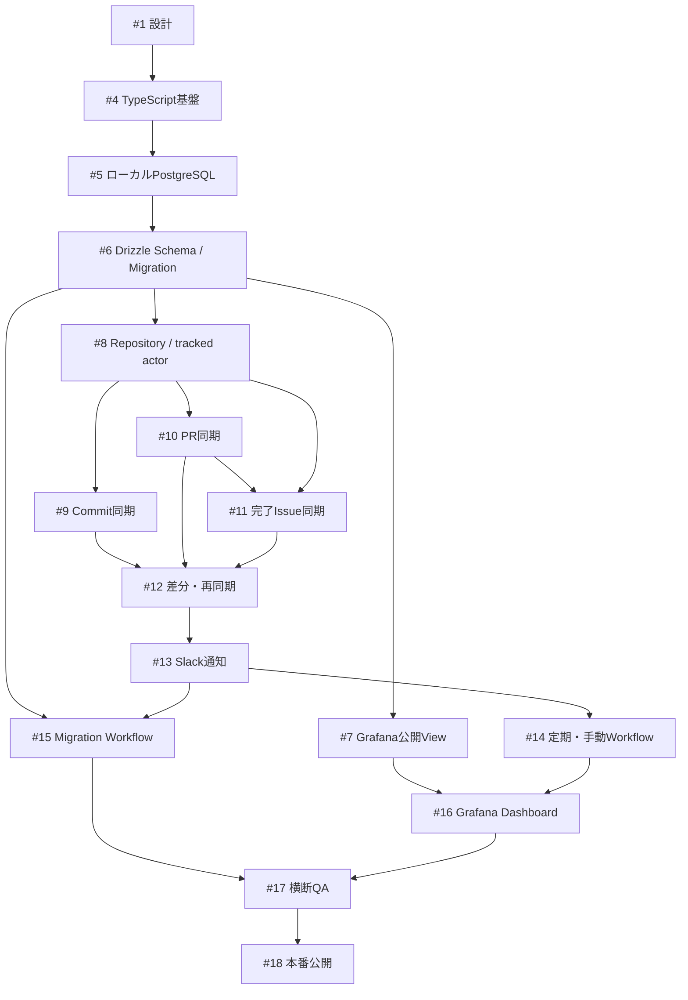

# 実装Issue分解案

## 方針

依存関係の順に小さなIssueへ分け、各Issueで実装、検証、PR作成まで完結させる。

1. TypeScript／pnpm／Vitestの初期構築
2. Docker ComposeによるローカルPostgreSQL環境
3. Drizzle Schema、Migration、DB Role、公開View
4. Fine-grained PATとOctokitによるリポジトリ・tracked actor取得
5. デフォルトブランチのコミット同期
6. 作成・マージPR同期
7. 完了IssueのOR判定、初回Close、タイトル更新
8. 48時間重複同期、期間指定・全再同期、同期履歴
9. Slack DM通知と機密情報除去
10. GitHub Actionsの定期・手動同期
11. DB Migration用手動Workflow
12. Grafana公開ViewとDashboard作成・JSON Export
13. セキュリティ・レスポンシブ・公開前QA

## 共通受け入れ条件

- Issueの目的、範囲、スコープ外が明記される
- lint、型チェック、テスト、buildが通る
- 同期は冪等である
- Privateリポジトリ名がログ、Slack、公開Viewへ出ない
- エラー時も後続リポジトリを処理できる
- READMEと該当docsが実装実態へ更新される

## 優先度

- P0: 1〜11。データ収集と安全な保存を完成させる
- P1: 12。GrafanaでMVPを公開する
- P1: 13。公開前の最終確認を行う
