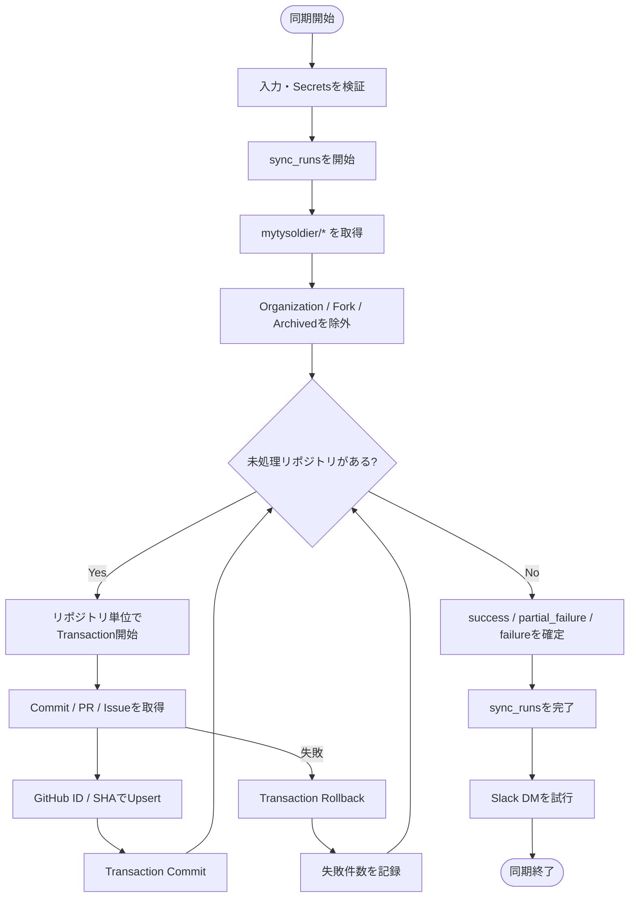
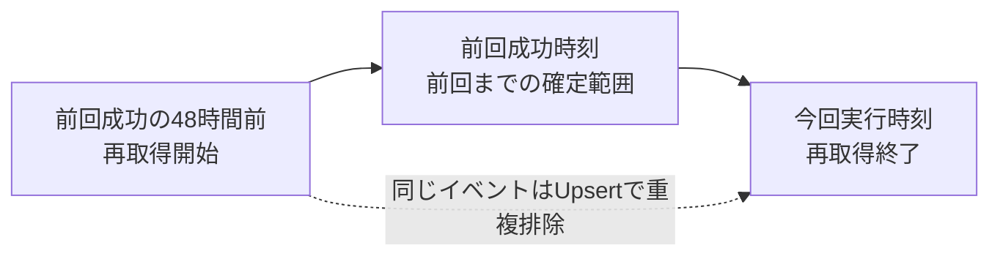
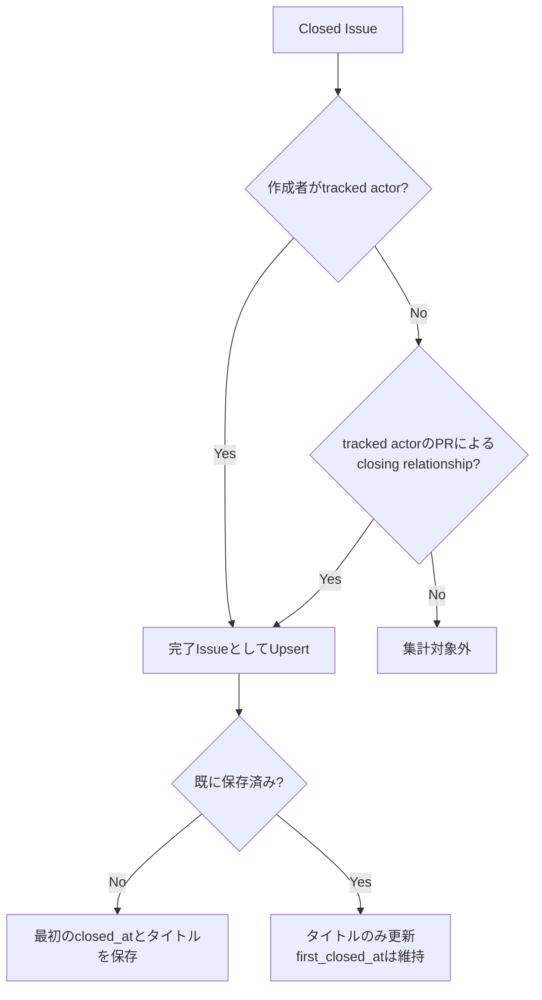

# GitHub同期仕様

## 実行種別

| 種別 | 起動 | 対象期間 |
| --- | --- | --- |
| 定期差分 | JST 08:00／14:00／22:00 | 最終成功時刻の48時間前以降 |
| 手動差分 | `workflow_dispatch` | 定期差分と同じ |
| 期間指定 | `workflow_dispatch` | 指定した開始日・終了日 |
| 全再同期 | `workflow_dispatch` | GitHub APIで取得可能な全期間 |

初回同期は過去30日を対象にする。すべての実行でSlack通知を試行する。

## 処理フロー

1. 実行条件を検証して`sync_runs`を開始する
2. `mytysoldier/*`のリポジトリ一覧を取得する
3. Organization、Fork、Archivedを除外する
4. 新規リポジトリを内部テーブルへ追加する
5. tracked actorを読み込む
6. 各リポジトリのコミット、PR、完了Issueを取得してUpsertする
7. 完了Issueのタイトルと状態を再確認する
8. 実行全体の結果を`sync_runs`へ保存する
9. Slack DMを送信する

## 差分同期

最終成功時刻以降だけを取得するとAPI反映遅延や途中失敗で漏れるため、通常同期では48時間重ねて再取得する。GitHub ID／SHAの一意制約とUpsertにより二重計上を防ぐ。

全リポジトリが成功した場合のみ実行全体の最終完全成功時刻を進める。個別リポジトリの成功日時はそれぞれ記録する。

## リポジトリ単位の失敗

- リポジトリ単位で処理とトランザクションを分離する
- 1件が失敗しても後続リポジトリを継続する
- 失敗したリポジトリの途中データはRollbackする
- 成功したリポジトリのデータはCommitする
- 1件以上失敗した実行は`partial_failure`とする
- Slackや公開Viewへ失敗リポジトリ名を出さない

## Issue同期

- author条件とPR Close条件をORで判定する
- GitHubがclosing relationshipとして返すPRのみを使用する
- PR本文に単なるIssue URLがあるだけの場合は対象外とする
- 最初のClose日時を保持し、再Closeを追加計上しない
- タイトル変更を反映する
- 少なくとも1日1回、保存済み完了Issueのタイトル・状態を再確認する
- Not Foundだけで削除と断定せず、DBから自動削除しない

## Slack通知

定期・手動・Migrationの成功／失敗で、次をDMする。

- 実行種別と結果
- 開始・終了日時、対象期間
- 対象／成功／失敗リポジトリ数
- コミット、PR、Issueの取得・反映件数
- GitHub API残量
- 機密情報を含まないエラー概要
- GitHub Actions実行URL

Slack送信だけが失敗した場合、データ同期結果は変更せず、`notification_status`へ記録する。通知失敗を理由に同期Workflowを失敗させず、再送もしない。
